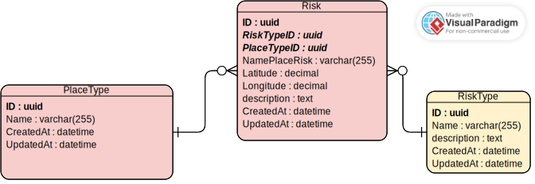

# backend Risk Place

## Começar

### Pré-requisitos

* [Golang](https://golang.org/doc/install) - The language used
* [Docker](https://docs.docker.com/install/) - Containerization platform
* [Docker Compose](https://docs.docker.com/compose/install/) - Container orchestration

### Instalando

* Instalar o [Golang](https://golang.org/doc/install) e configurar o ambiente de desenvolvimento.

* Versão do Golang utilizada: `1.19.2`


* Clonar o repositório

```
git clone https://github.com/risk-place-angola/backend-risk-place.git
```

* Criar uma cópia do ficheiro `.env.example' e renomeá-lo para `.env'.

```
cp .env.example .env
```

* Instalar as dependências

```
go mod tidy
```

* Execute o seguinte comando para iniciar a aplicação

```
go run main.go
```

## Realização dos testes

* Executar o seguinte comando para executar os testes

```
go test ./...
```

## Construído com

* [Golang](https://golang.org/) - The language used
* [Echo](https://echo.labstack.com/) - Web framework
* [GORM](https://gorm.io/) - ORM
* [air](https://github.com/cosmtrek/air) - Live reload


## 🤝 Contribuição
> Antes de abrir uma issue ou pull request, verifique o documentos de contribuição do projeto.

Por favor leia [CONTRIBUTING.md](https://github.com/risk-place-angola/backend-risk-place/blob/main/CONTRIBUTING.md) 
para detalhes sobre o nosso código de conduta, e o processo para submeter pedidos de pull.

## Diagrama de entidade



### Detalhes para cada entidade do diagrama

* **Place Type**: Tipo de locais que podem ser cadastrados no sistema. Ex: `Riscos`, `Trabalho`, `Escola`, `Parque`, `Igreja`, `Hospital` etc.

> Nota: O tipo de local é um campo obrigatório para o cadastro de um local. O primeiro local que vamos utilizar é o tipo `Risco`.

* **Riscos**: Vão cadastrar os locais que consideram riscos. Ex: `Bairro X`, `Rua Y`, `Latitude`, `Longitude` etc.

* **Tipos de um riscos**: aqui vamos cadastrar os tipos riscos que podem ser encontrados em um local. Ex: `Criminalidade`, `Vala`, `doença`.
    * **Topicos**: aqui vamos cadastrar os tópicos de um risco. Ex: `Assalto`, `Incêndio`, `Furto`, `Assalto`, `Acidente`, `Roubo`, `Inundação` etc.
    
    
 ## 🍕 Comunidade
 
 Junte-se à conversa ao nosso https://discord.gg/s2Nk4xYV
