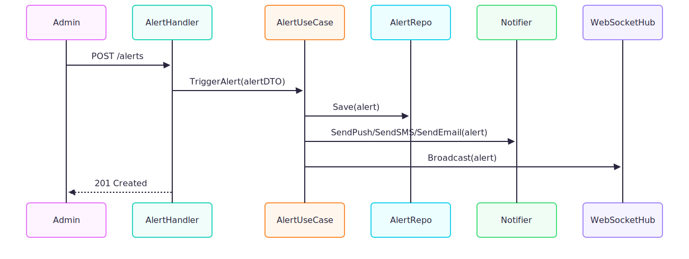
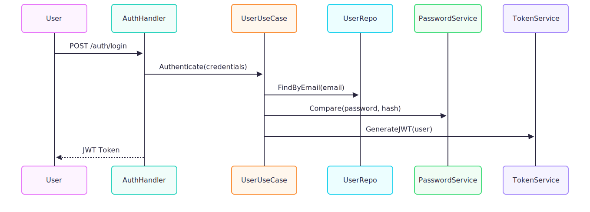

# Risk Place Angola - Backend

[](https://golang.org)
[](LICENSE)
[](CONTRIBUTING.md)

**Risk Place Angola (RPA)** is an open-source platform designed to map, monitor, and report risk locations across Angola, connecting citizens, emergency entities, and local communities in real-time.

The backend serves as the core engine responsible for:
- 🌐 Handling RESTful API requests
- 🚨 Managing alerts & incident reports
- 📍 Integrating geolocation services
- 📱 Push notifications via Firebase (FCM)
- 💬 SMS notifications via Twilio
- 🔌 Real-time WebSocket communication
- 💾 Data persistence (PostgreSQL + Redis)
- 📊 Logging, metrics, and comprehensive error handling




## 📁 Project Structure

```
backend-risk-place/
├── cmd/api/                    # Application entry point
├── internal/
│   ├── adapter/                # External adapters
│   │   ├── http/              # HTTP handlers, middleware, routing
│   │   ├── websocket/         # WebSocket server & client management
│   │   ├── notifier/          # Email, SMS, and push notifications
│   │   ├── repository/        # Data persistence (PostgreSQL)
│   │   └── service/           # External service integrations
│   ├── application/           # Application layer
│   │   ├── dto/              # Data Transfer Objects
│   │   ├── port/             # Interface definitions
│   │   └── usecase/          # Business use cases
│   ├── domain/                # Core domain logic
│   │   ├── model/            # Domain entities
│   │   ├── event/            # Domain events & dispatcher
│   │   ├── service/          # Domain services
│   │   ├── errors/           # Domain-specific errors
│   │   └── repository/       # Repository interfaces
│   ├── infra/                 # Infrastructure layer
│   │   ├── bootstrap/        # Dependency injection container
│   │   ├── db/               # Database setup
│   │   ├── redis/            # Redis client
│   │   ├── fcm/              # Firebase Cloud Messaging
│   │   ├── twilio/           # Twilio SMS service
│   │   └── logger/           # Structured logging
│   └── config/                # Configuration management
├── migrations/                # Database migration scripts
├── api/                       # Swagger API documentation
├── docs/                      # Technical documentation & diagrams
├── .githooks/                 # Git hooks for quality checks
└── tmp/                       # Build artifacts & temporary files
```

### Architecture

This project follows **Clean Architecture** principles with clear separation of concerns:
- **Domain Layer**: Business logic independent of frameworks
- **Application Layer**: Use cases orchestrating domain logic
- **Adapter Layer**: Implementation of external interfaces
- **Infrastructure Layer**: Technical capabilities (DB, cache, messaging)




## 🚀 Getting Started

### Prerequisites

Ensure you have the following installed:

- **[Go 1.25.3+](https://golang.org/doc/install)** - Programming language
- **[Docker](https://docs.docker.com/install/)** - Containerization platform
- **[Docker Compose](https://docs.docker.com/compose/install/)** - Multi-container orchestration
- **[Make](https://www.gnu.org/software/make/)** - Build automation (usually pre-installed on Unix systems)
- **[PostgreSQL 14+](https://www.postgresql.org/download/)** - Primary database
- **[Redis 7+](https://redis.io/download)** - Cache & session store

### Installation

1. **Clone the repository**

```bash
git clone https://github.com/risk-place-angola/backend-risk-place.git
cd backend-risk-place
```

2. **Set up environment variables**

```bash
cp .env.example .env
```

Edit `.env` with your configuration:
- Database credentials
- Firebase service account
- Twilio credentials
- JWT secrets
- Redis connection

3. **Install Go dependencies**

```bash
go mod download
```

4. **Install development tools**

```bash
# Install Git hooks for pre-commit checks
make githooks

# Install golangci-lint (linter)
make lint

# Install govulncheck (security scanner)
go install golang.org/x/vuln/cmd/govulncheck@latest

# Install swag (Swagger documentation generator)
go install github.com/swaggo/swag/cmd/swag@latest
```

5. **Start infrastructure services**

```bash
docker-compose up -d
```

This starts:
- PostgreSQL on port `5432`
- Redis on port `6379`
- Mailpit (email testing) on port `1025` (SMTP) / `8025` (Web UI)

6. **Run the application**

```bash
# Development mode
go run cmd/api/main.go

# Or use Make
make build
./tmp/main
```

The API will be available at `http://localhost:8000`

## 🛠️ Development Workflow

### Available Make Commands

```bash
make lint          # Run linter (golangci-lint)
make test          # Run tests with coverage
make sec-scan      # Run security vulnerability scan
make build         # Build the application binary
make swagger       # Generate Swagger API documentation
make githooks      # Install git hooks
make clean-gcl     # Clean linter cache
```

### Running Tests

```bash
# Run all tests
make test

# Run tests with verbose output
go test -v ./...

# Run tests for specific package
go test -v ./internal/domain/model

# Run with coverage report
go test -cover -coverprofile=coverage.out ./...
go tool cover -html=coverage.out
```

### Code Quality

This project enforces high code quality standards:

```bash
# Lint your code
make lint

# Security scan
make sec-scan

# Format code
go fmt ./...
```

**Pre-commit hooks** automatically run:
- Code formatting
- Linting
- Security checks

### Generate API Documentation

```bash
# Generate Swagger docs
make swagger

# View documentation
# Start the server and visit: http://localhost:8000/docs/index.html
```

## 🏗️ Built With

### Core Technologies
- **[Go 1.25.3+](https://golang.org/)** - Programming language
- **[net/http](https://pkg.go.dev/net/http)** - Standard HTTP server
- **[gorilla/websocket](https://github.com/gorilla/websocket)** - WebSocket implementation

### Database & Persistence
- **[PostgreSQL](https://www.postgresql.org/)** - Primary relational database
- **[lib/pq](https://github.com/lib/pq)** - PostgreSQL driver
- **[SQLC](https://sqlc.dev/)** - Type-safe SQL code generator
- **[Redis](https://redis.io/)** - Caching & location store

### External Integrations
- **[Firebase Admin SDK](https://firebase.google.com/docs/admin/setup)** - Push notifications (FCM)
- **[Twilio](https://www.twilio.com/)** - SMS & voice notifications
- **[Google Cloud](https://cloud.google.com/)** - Cloud services

### Security & Authentication
- **[JWT](https://github.com/golang-jwt/jwt)** - JSON Web Tokens for authentication
- **[bcrypt](https://pkg.go.dev/golang.org/x/crypto/bcrypt)** - Password hashing

### Development Tools
- **[Swaggo](https://github.com/swaggo/swag)** - Swagger documentation generator
- **[golangci-lint](https://golangci-lint.run/)** - Fast Go linters runner
- **[govulncheck](https://pkg.go.dev/golang.org/x/vuln/cmd/govulncheck)** - Security vulnerability scanner
- **[Docker](https://www.docker.com/)** - Containerization

### Configuration & Utilities
- **[Viper](https://github.com/spf13/viper)** - Configuration management
- **[govalidator](https://github.com/asaskevich/govalidator)** - Data validation
- **[UUID](https://github.com/google/uuid)** - UUID generation

## 📊 Services & Integrations

| Service | Purpose | Configuration |
|---------|---------|---------------|
| **PostgreSQL** | Main database for persistent storage | `DB_*` env vars |
| **Redis** | Location caching & session storage | `REDIS_*` env vars |
| **Firebase (FCM)** | Push notifications to mobile devices | `FIREBASE_*` env vars |
| **Twilio** | SMS & voice notifications | `TWILIO_*` env vars |
| **WebSocket Hub** | Real-time alert broadcasting | Built-in |
| **SMTP** | Email notifications (via Mailpit for dev) | `EMAIL_*` env vars |

## 🧪 Testing

The project aims for comprehensive test coverage:

```bash
# Run tests
make test

# Run specific test
go test -run TestUserValidation ./internal/domain/model

# Run benchmarks
go test -bench=. ./...
```


## 📖 API Documentation

Once the server is running, access the interactive API documentation:

**Swagger UI**: `http://localhost:8000/docs/index.html`

The API follows RESTful principles with the following main endpoints:

| Endpoint | Description |
|----------|-------------|
| `POST /api/v1/auth/signup` | User registration |
| `POST /api/v1/auth/login` | User authentication |
| `GET /api/v1/alerts` | List alerts |
| `POST /api/v1/alerts` | Create new alert |
| `GET /api/v1/reports` | List reports |
| `POST /api/v1/reports` | Submit new report |
| `GET /api/v1/risks/types` | List risk types |
| `WS /ws/alerts` | WebSocket connection for real-time alerts |

### Core Entities

- **Users**: Citizens, administrators, and emergency responders
- **Roles**: User permission management
- **Risk Types**: Categories of risks (Crime, Infrastructure, Health, etc.)
  - **Risk Topics**: Subcategories (Robbery, Fire, Flood, etc.)
- **Reports**: User-submitted risk reports with location data
- **Alerts**: Broadcast warnings created by authorities
- **Notifications**: Push, SMS, and email notifications

### Key Features

- **Geolocation**: Latitude/longitude coordinates for precise mapping
- **Address Normalization**: Province, Municipality, Neighborhood structure
- **Status Workflow**: Pending → Verified → Resolved
- **Notification System**: Multi-channel delivery (Push, SMS, Email)
- **Real-time Updates**: WebSocket-based alert broadcasting

### Diagrams

#### Alert Use Cases


#### Reporting Use Cases


#### User Authentication Use Cases


### Notification Flow


## 🔐 Environment Variables

| Variable | Description | Example |
|----------|-------------|---------|
| `APP_ENV` | Application environment | `development` / `production` |
| `PORT` | API server port | `8000` |
| `DB_HOST` | PostgreSQL host | `localhost` |
| `DB_PORT` | PostgreSQL port | `5432` |
| `DB_USER` | Database user | `postgres` |
| `DB_PASSWORD` | Database password | `your_password` |
| `DB_NAME` | Database name | `riskplace` |
| `REDIS_HOST` | Redis host | `localhost` |
| `REDIS_PORT` | Redis port | `6379` |
| `REDIS_PASSWORD` | Redis password | `your_redis_password` |
| `REDIS_DB` | Redis database number | `0` |
| `JWT_SECRET` | JWT signing secret | `your_jwt_secret` |
| `JWT_ISSUER` | JWT issuer | `riskplace-angola` |
| `JWT_AUDIENCE` | JWT audience | `riskplace-users` |
| `FIREBASE_PROJECT_ID` | Firebase project ID | `your-project-id` |
| `FIREBASE_PRIVATE_KEY` | Firebase private key (base64) | `LS0t...` |
| `FIREBASE_CLIENT_EMAIL` | Firebase client email | `your-client-email` |
| `TWILIO_ACCOUNT_SID` | Twilio account SID | `AC...` |
| `TWILIO_AUTH_TOKEN` | Twilio auth token | `your_auth_token` |
| `TWILIO_MESSAGE_SERVICE_SID` | Twilio message service SID | `your_message_service_sid` |
| `EMAIL_HOST` | SMTP host | `smtp.gmail.com` |
| `EMAIL_PORT` | SMTP port | `587` |
| `EMAIL_USER` | SMTP username | `your_email_user` |
| `EMAIL_PASSWORD` | SMTP password | `your_email_password` |
| `EMAIL_SSL` | Use SSL for SMTP | `true` / `false` |
| `EMAIL_TLS` | Use TLS for SMTP | `true` / `false` |


See `.env.example` for a complete list of configuration options.

## 🚀 Deployment

### Docker Deployment

```bash
# Build the Docker image
docker build -t riskplace-backend .

# Run the container
docker run -d \
  --name riskplace-api \
  -p 8000:8000 \
  --env-file .env \
  riskplace-backend
```

### Production Checklist

- [ ] Set `APP_ENV=production`
- [ ] Use strong, unique secrets for `JWT_SECRET`
- [ ] Enable PostgreSQL SSL (`SSL_MODE=require`)
- [ ] Configure proper CORS origins
- [ ] Set up database backups
- [ ] Enable Redis persistence
- [ ] Configure rate limiting
- [ ] Set up monitoring and logging
- [ ] Use HTTPS/TLS for all endpoints
- [ ] Review and update security headers

## 🤝 Contributing

We welcome contributions from the community! Please read our [CONTRIBUTING.md](CONTRIBUTING.md) for:

- Code of conduct
- Development workflow
- Pull request process
- Coding standards
- Commit message conventions

### Quick Start for Contributors

1. Fork the repository
2. Create a feature branch (`git checkout -b feature/amazing-feature`)
3. Make your changes
4. Run tests and linters (`make test && make lint`)
5. Commit your changes (`git commit -m 'feat: add amazing feature'`)
6. Push to your branch (`git push origin feature/amazing-feature`)
7. Open a Pull Request

## 🐛 Troubleshooting

### Common Issues

**Database connection failed**
```bash
# Check if PostgreSQL is running
docker-compose ps

# Check connection string in .env
# Ensure DB_HOST, DB_PORT, and credentials are correct
```

**Redis connection timeout**
```bash
# Verify Redis is accessible
redis-cli -h localhost -p 6379 ping

# Should return: PONG
```

**FCM push notifications not working**
```bash
# Verify FIREBASE_PRIVATE_KEY is base64 encoded
```

**Swagger not generating**
```bash
# Reinstall swag
go install github.com/swaggo/swag/cmd/swag@latest

# Regenerate docs
make swagger
```

**SQLC generated code issues**
```bash
# Ensure SQLC is installed
go install github.com/kyleconroy/sqlc/cmd/sqlc@latest

make sqlc
```

## 📝 License

This project is licensed under the MIT License - see the [LICENSE](LICENSE) file for details.

## 🍕 Community

Join the conversation and connect with other contributors:

- **Discord**: [Join our server](https://discord.gg/s2Nk4xYV)
- **GitHub Issues**: [Report bugs or request features](https://github.com/risk-place-angola/backend-risk-place/issues)
- **GitHub Discussions**: [Ask questions and share ideas](https://github.com/risk-place-angola/backend-risk-place/discussions)

## 📞 Support

If you encounter any problems or have questions:

1. Check the [documentation](docs/)
2. Search [existing issues](https://github.com/risk-place-angola/backend-risk-place/issues)
3. Join our [Discord community](https://discord.gg/s2Nk4xYV)
4. Create a [new issue](https://github.com/risk-place-angola/backend-risk-place/issues/new)

## 🙏 Acknowledgments

- All [contributors](https://github.com/risk-place-angola/backend-risk-place/graphs/contributors) who have helped shape this project
- The Angolan tech community for their support and feedback
- Open-source libraries and tools that make this project possible

---

**Made with ❤️ by the Risk Place Angola team**

*Mapping risks, saving lives* 🗺️🚨
